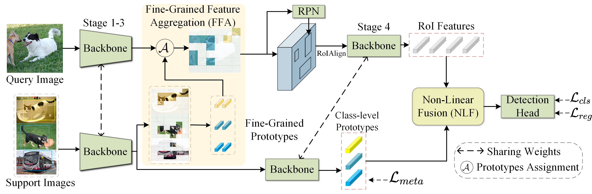

## Introduction
>[**Fine-Grained Prototypes Distillation for Few-Shot Object Detection (AAAI2024)**](https://arxiv.org/pdf/2401.07629.pdf)
> 


This repo is based on [MMFewShot](https://github.com/open-mmlab/mmfewshot).

## Quick Start
```bash
# creat a conda environment
conda create -n fpd python=3.8
conda activate fpd
conda install pytorch==1.12.1 torchvision==0.13.1 torchaudio cudatoolkit=11.3 -c pytorch -c conda-forge

# dependencies
pip install openmim
mim install mmcv-full==1.6.0
mim install mmcls==0.25.0
mim install mmdet==2.24.0
pip install -r requirements.txt

# install mmfewshot
pip install git+https://github.com/open-mmlab/mmfewshot.git
# or manually download the code, then
# cd mmfewshot
# pip install .

# install FPD
python setup.py develop
```

## Prepare Datasets
Please refer to [mmfewshot/data](https://github.com/open-mmlab/mmfewshot/blob/main/tools/data/README.md)
for the data preparation steps.

## Results on VOC Dataset
* Base Training

| Config | Split | Base AP50 | ckpt |
|:---:|:---:|:---:|:---:|
|[config](configs/fpd/voc/split1/fpd_r101_c4_2xb4_voc-split1_base-training.py)|1|79.8|[ckpt](https://github.com/wangchen1801/FPD/releases/download/ckpts_fpd/fpd_r101_c4_2xb4_voc-split1_base-training_iter_20000.pth)|
|[config](configs/fpd/voc/split2/fpd_r101_c4_2xb4_voc-split2_base-training.py)|2|80.3|[ckpt](https://github.com/wangchen1801/FPD/releases/download/ckpts_fpd/fpd_r101_c4_2xb4_voc-split2_base-training_iter_20000.pth)|
|[config](configs/fpd/voc/split3/fpd_r101_c4_2xb4_voc-split3_base-training.py)|3|80.2|[ckpt](https://github.com/wangchen1801/FPD/releases/download/ckpts_fpd/fpd_r101_c4_2xb4_voc-split3_base-training_iter_20000.pth)|

* Few Shot Fine-tuning

| Config | Split | Shot | Novel AP50 | ckpt | log |
|:---:|:---:|:---:|:---:|:---:|:---:|
|[config](configs/fpd/voc/split1/fpd_r101_c4_2xb4_voc-split1_10shot-fine-tuning.py)|1|10|68.4|[ckpt](https://github.com/wangchen1801/FPD/releases/download/ckpts_fpd/fpd_r101_c4_2xb4_voc-split1_10shot-fine-tuning_iter_2000.pth)|[log](https://github.com/wangchen1801/FPD/releases/download/ckpts_fpd/fpd_r101_c4_2xb4_voc-split1_10shot-fine-tuning.log)|
|[config](configs/fpd/voc/split2/fpd_r101_c4_2xb4_voc-split2_10shot-fine-tuning.py)|2|10|53.9|[ckpt](https://github.com/wangchen1801/FPD/releases/download/ckpts_fpd/fpd_r101_c4_2xb4_voc-split2_10shot-fine-tuning_iter_2000.pth)|[log](https://github.com/wangchen1801/FPD/releases/download/ckpts_fpd/fpd_r101_c4_2xb4_voc-split2_10shot-fine-tuning.log)|
|[config](configs/fpd/voc/split3/fpd_r101_c4_2xb4_voc-split3_10shot-fine-tuning.py)|3|10|62.9|[ckpt](https://github.com/wangchen1801/FPD/releases/download/ckpts_fpd/fpd_r101_c4_2xb4_voc-split3_10shot-fine-tuning_iter_3200.pth)|[log](https://github.com/wangchen1801/FPD/releases/download/ckpts_fpd/fpd_r101_c4_2xb4_voc-split3_10shot-fine-tuning.log)|

## Results on COCO Dataset
* Base Training

| Config | Base mAP | ckpt |
|:---:|:---:|:---:|
|[config](configs/fpd/coco/fpd_r101_c4_2xb4_coco_base-training.py)|36.0|[ckpt](https://github.com/wangchen1801/FPD/releases/download/ckpts/fpd_r101_c4_2xb4_coco_base-training_iter_110000.pth)|

* Few Shot Fine-tuning

| Config | Shot | Novel mAP (nAP) | ckpt | log |
|:---:|:---:|:---:|:---:|:---:|
|[config](configs/fpd/coco/fpd_r101_c4_2xb4_coco_30shot-fine-tuning.py)|30|20.1|[ckpt]()|[log](https://github.com/wangchen1801/FPD/releases/download/ckpts/fpd_r101_c4_2xb4_coco_30shot-fine-tuning.log)|

## Evaluation

```bash
# single-gpu test
python test.py ${CONFIG} ${CHECKPOINT} --eval mAP|bbox

# multi-gpus test
bash dist_test.sh ${CONFIG} ${CHECKPOINT} ${NUM_GPU} --eval mAP|bbox
```

* For example, test pretrained weights on VOC Split1 10-shot with 2 gpus:

```bash
bash dist_test.sh \
    configs/fpd/voc/split1/fpd_r101_c4_2xb4_voc-split1_10shot-fine-tuning.py \
    ./work_dirs/fpd_r101_c4_2xb4_voc-split1_10shot-fine-tuning/fpd_r101_c4_2xb4_voc-split1_10shot-fine-tuning_iter_2000.pth 2 --eval mAP
```

* Test pretrained weights on COCO 30-shot with 2 gpus:
```bash
bash dist_test.sh \
    configs/fpd/coco/fpd_r101_c4_2xb4_coco_30shot-fine-tuning.py \
    ./work_dirs/fpd_r101_c4_2xb4_coco_30shot-fine-tuning/fpd_r101_c4_2xb4_coco_30shot-fine-tuning_iter_18000.pth 2 --eval bbox
```

## Training
```bash
# single-gpu training
python train.py ${CONFIG}

# multi-gpus training
bash dist_train.sh ${CONFIG} ${NUM_GPU}
```
* Training FPD on VOC dataset with 2 gpus:
```bash
# base training
bash dist_train.sh \
    configs/fpd/voc/split1/fpd_r101_c4_2xb4_voc-split1_base-training.py 2
    
# few-shot fine-tuning
bash dist_train.sh \
    configs/fpd/voc/split1/fpd_r101_c4_2xb4_voc-split1_10shot-fine-tuning.py 2
```
* Training FPD on COCO dataset with 2 gpus:
```bash
# base training
bash dist_train.sh \
    configs/fpd/coco/fpd_r101_c4_2xb4_coco_base-training.py 2
    
# few-shot fine-tuning
bash dist_train.sh \
    configs/fpd/coco/fpd_r101_c4_2xb4_coco_30shot-fine-tuning.py 2 
```

## Citation
If you would like to cite this paper, please use the following BibTeX entries:
```BibTeX
@InProceedings{wang2024fpd,
  title={Fine-Grained Prototypes Distillation for Few-Shot Object Detection},
  author={Wang, Zichen and Yang, Bo and Yue, Haonan and Ma, Zhenghao},
  booktitle = {Proceedings of the 38th AAAI Conference on Artificial Intelligence (AAAI-24)},
  year={2024}
}
```
